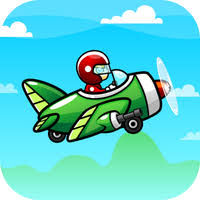
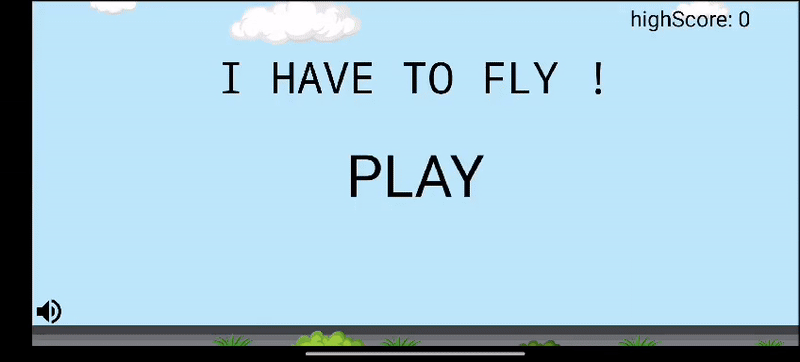

## Bird Shooting Game

Built a bird shooting game with touch controls, scoring, and animations. Optimized for smooth gameplay on Android devices using Android Studio. Designed UI with XML for efficient layout management.

##Features
* **Audio Effects 🔊:** Realistic sound effects for shooting and bird movements to enhance immersion.
  
* **Interactive Gameplay 🎮:** Shoot birds by tapping on the screen to score points.
                              Increasing difficulty as birds move faster over time.
  
* **Score Tracking 🏆:** Real-time score display during gameplay.
                          Display the highest scores.
  
* **Game Mechanics ⚙️:** Collision detection between bullets and birds for precise gameplay.
------------
  ## Technologies Used
-  Android Studio
-  Java
-  XML
---------

## Screenshots

* The logo of game :

----
## Demo Video of game  🎮

